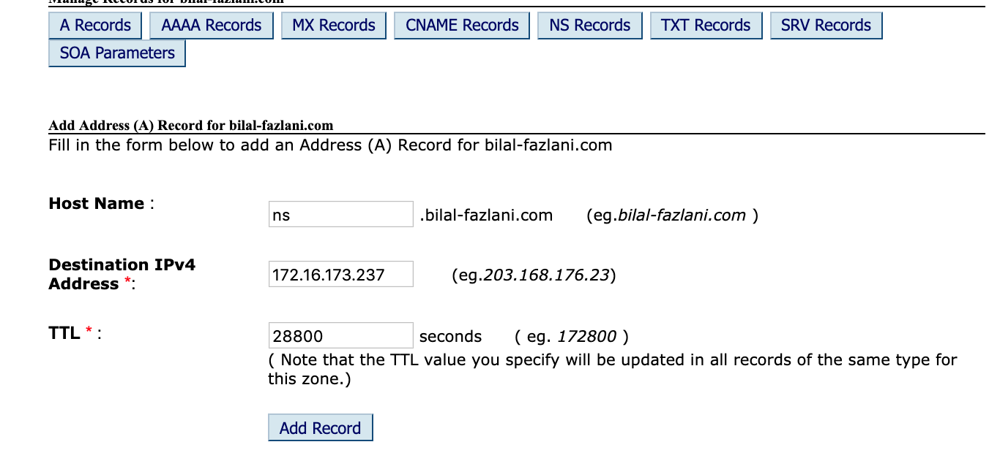
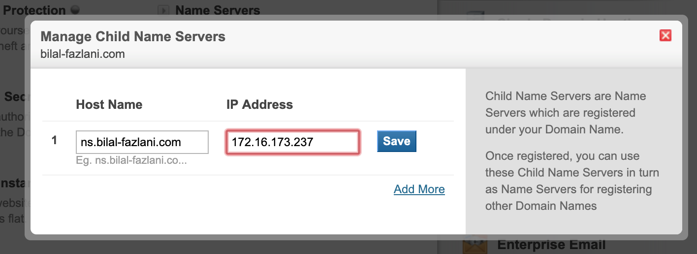

### Nnstall dnsmasq in centos:
guide: https://linuxhint.com/configure_dnsmasq_centos/

domain name: example.com

### Redirect all apps.example.com to another dns server (location service)
https://serverfault.com/a/420748/378802

### Add A record in DNS control panel

This should be the public ip address of dnsmasq

### Add an entry for Child name server

This probably will take about 2 days to take effect.

### Dns testing tools

1. https://www.whatsmydns.net
1. https://intodns.com

